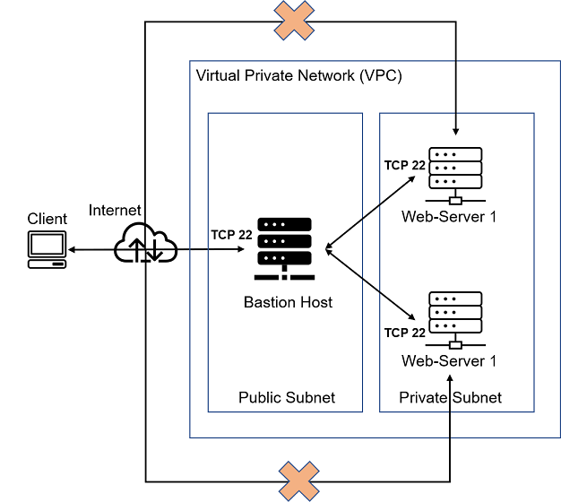

# Ansible-Automate-Project
### Ansible configuration management

## What is Ansible?

Ansible is an open-source IT automation tool that automates provisioning, configuration management, application deployment, orchestration, and many other manual IT processes. Unlike more simplistic management tools, Ansible users (like system administrators, developers and architects) can use Ansible automation to install software, automate daily tasks, provision infrastructure, improve security and compliance, patch systems, and share automation across the entire organization.

Ansible is a tool and can be used as deployment and configuration.

Ansible has Host inventory and playbooks.

Ansible works with modules and some plugins.

Ansible is used to automate infrastructure i.e resources on AWS(cloud resources). Tools used in setting up a server is the infrastructure.

Ansible is agentless, meaning you don't need to install ansible in all nodes/target. Once you install it on master it controls all the nodes.

__Why companies use Ansible:__

 Suppose we have 100 servers, and we want to install nginx in all the servers at the same time. so how would we perform this task? I don’t think it’s convenient way to manually go to each server and install nginx one by one. so here Ansible comes in the picture. so now with the help of this amazing tool we can install nginx in all the 100 servers just by a single click. 

 Ansible allows you to configure multiple nodes at one time from one single controller using Infrastructure as code.

 

 The server which has ansible installed is known as the __Control node__ while the remote hosts/servers which are configured are known as __Managed nodes.__

 __In ansible, you have two approaches to configure things: i.e different ways we communicate with ansible from controller to target or nodes__ 

- Ad-hoc commands (Command-line).

- Playbooks.

__AD-HOC COMMANDS__

Ad hoc commands are useful for quick, one-off tasks or troubleshooting when you don't want to create a full playbook. It means doing it over the terminal.

Ad Hoc Commands Format are typically written in the following format:

`ansible <target_hosts> -m <module_name> -a "<module_arguments>"`

__target_hosts:__ The host or hosts on which you want to run the command.

__module_name:__ The Ansible module you want to use for the task.

__module_arguments:__ The specific arguments and options required for the module. 

For example, you might use an ad hoc command to check the disk space on a group of remote servers. The command could look like this:

`ansible web_servers -m shell -a "df -h"`

__web_servers:__ is the group of target hosts.

__shell__ is the Ansible module used to run a shell command.

__"df -h"__ is the command to check disk space.

__PLAYBOOK__

An Ansible playbook is a configuration management and automation tool that is used to define a set of tasks to be executed on one or more remote hosts. Playbooks are a fundamental concept in Ansible and are written in YAML (Yet Another Markup Language) format, making them human-readable and easy to write. These playbooks allow you to define the desired state of the systems you manage and automate the process of achieving that state.

Playbooks is a collection of organised tasks in form of plays, which is creating a file.

 
In playbooks, we write everything that needs to be configured on remote servers known as tasks. The playbook contains three things: -

1) Name of the play.

2) Hosts

3) Tasks: The format used for writing playbooks is YAML.

The remote servers or hosts which need to be configured are mentioned in the Inventory. There are two types of inventories: -

1) Static Inventory: is a text-based file that consists of a list of managed host servers and IP addresses, usually bundled in groups. Static inventories are usually stored in the form of an INI or a YAML file.

2) Dynamic Inventory. We use dynamic inventory if our hosts are running on top of the cloud or in a container engine where the hosts are up and down frequently.

__Ansible Client as a jump server__

A jump server, also known as (Bastion Host) a jump host or a jump box, is a specialized computer used as an intermediary access point to connect to other devices or servers in a network. It is commonly employed in environments where security and access control are critical, such as in data centers, corporate networks, or cloud infrastructures. The primary purpose of a jump server is to enhance security and control remote access to other servers or devices.

In the diagram below, the Virtual Private Network (VPC) is divided into two subnets – Public subnet has public IP addresses and Private subnet is only reachable by private IP addresses.

We will be performing the following tasks:

- Install and configure Ansible client to act as a Jump Server/Bastion Host.

- Create a simple Ansible playbook to automate servers configuration.

__INSTALL AND CONFIGURE ANSIBLE ON EC2 INSTANCE__

We will update the __Name tag__ on our __Jenkins EC2 Instance__ to __Jenkins-Ansible.__ We will use this server to run our playbooks.

In the GitHub account, we create a new repository and name it __ansible-config-mgt__.

Update the repository and Install Ansible

`sudo apt update -y && sudo apt install ansible`

Check your ansible version by running this command:

`ansible --version`

Configure Jenkins build job to save your repository content every time there is an edit. Go to "configure" and edit the following:

Create a new Freestyle project my-job in Jenkins and point it to your __ansible-config-mgt__ repository.

configure a webhook in Github and set the webhook to trigger my-job.

Configure the __"ansible-config-mgt"__ to connect to the jenkins through webhook to trigger build automatically. In the __"ansible-config-mgt"__ repository, we click on settings. Click on __"webhook"__. Then click on __"add webhook"__.

In the __"project URL"__, put in the jenkins IP address and select __"application/json"__ in the __"content type"__.

`http://jenkins-IP-address:8080/github-webhook/`

Then click on __"add webhook"__.

__Configure a Post-build job to save and archive all artifacts i.e (**).__

Assuming you already have a Jenkins job set up to perform the build, navigate to the job's configuration page:

- Go to your Jenkins dashboard.

- Find the job you want to configure and click on it.
In the job configuration page, scroll down to the __"Post-build Actions"__ section.

Click the __"Add post-build action"__ dropdown and select __"Archive the artifacts."__

In the "Files to archive" field, you can specify the files or directories you want to archive. To archive all artifacts, you can use the wildcard `**` to match everything. If you have specific files or directories, you can list them individually or use patterns.

For example, to archive all files and directories, use `**`. If you only want to archive files with a specific extension, you can use `**/*`.extension.

Save your Jenkins job configuration by clicking the __"Save"__ button.

Now, when the build job runs, it will automatically save and archive all the specified artifacts in the __"archive"__ directory, and you can access them through Jenkins.

We can test our setup by making some change in README.md file.

The build is triggered automatically and Jenkins saves the files (build artifacts) in /var/lib/jenkins/jobs/my-job/builds/<build_number>/archive/ folder.

To check if the artifacts from the build was saved and archived successfully, we run the command:

`ls /var/lib/jenkins/jobs/my-job/builds/<build_number>/archive/`

`cat /var/lib/jenkins/jobs/my-job/builds/<build_number>/archive/README.md`

Your setup will look like this:

__Note:__ Every time the jenkins-ansible server stop/start, we have to reconfigure GitHub webhook to the new IP address. In order to avoid this, we allocate an Elastic IP to the Jenkins-Ansible server. Elastic IP is free only when it is being allocated to an EC2 Instance so we release Elastic IP once the instance is terminated.

Allocating an Elastic IP (EIP) to your Jenkins-Ansible server is a good solution to avoid having to reconfigure GitHub webhooks every time the server's IP address changes. An Elastic IP is a static, public IPv4 address that you can associate with your Amazon Web Services (AWS) resources, such as EC2 instances.  

__steps to allocate an Elastic IP to your server:__

1. In the EC2 Dashboard, select __"Elastic IPs"__ from the left-hand menu under __"Network & Security."__

2. Click the __"Allocate new address"__ button to create a new Elastic IP.

3. Once the EIP is allocated, select it from the list, and then click the __"Actions"__ button and choose __"Associate IP address."__

4. In the __"Associate Elastic IP address"__ dialog, select your Jenkins-Ansible server instance from the list of instances.

5. Click the __"Associate"__ button to associate the Elastic IP address with your server.

Now, your Jenkins-Ansible server will have a static, public IP address (the Elastic IP), and you won't need to reconfigure GitHub webhooks every time the server is stopped and started. Make sure to update your DNS records, if applicable, to reflect the new IP address.

__PREPARE THE DEVELOPMENT ENVIRONMENT__

There are varieties of IDEs available but we will be using __Vscode__. You can install __vscode__ [here](https://code.visualstudio.com/download).

After we are done with the Vscode set up, we need to install an extension known as Remote Development extension Pack. This extension allows us to access folders in a container or on a remote machine.

After we have successfully installed VSC, configure it to connect to your newly created GitHub repository.

Clone the ansible-config-mgt repo to the Jenkins-Ansible instance

`git clone <ansible-config-mgt repo link>`

`cd` into ansible-config-mgt

__BEGIN ANSIBLE DEVELOPMENT__

In the ansible-config-mgt GitHub repository, We create a new branch that will be used for development of a new feature and name it feature/proj-10

To show the present branch, we run the commands

`git branch`

To create a new branch 

`git checkout -b feature/proj-10`

The branch with an asterisk (*) next to it is the branch you are currently on.

We will create a directory and name it `playbooks`. It will be used to store all your playbook file.

`mkdir playbooks`

We will create a directory and name it `inventory`. It will used to keep your host organised.

`mkdir inventory`

We will create a file in our `playbooks folder` and name it `common.yml`

In the inventory folder, create an inventory file () for each environment (Development, staging,testing and production) `dev, staging, uat and prod` respectively. These inventory files use `.ini` languages style to configure ansible host.

__Set up an Ansible Inventory__

We will write an ansible inventory file which defines the hosts and groups of hosts upon which commands, modules, and tasks in a playbook operate which executes Linux commands on remote hosts.

__Note:__ Ansible uses TCP port 22 by default, which means it needs to ssh into target servers from Jenkins-Ansible host – for this we will need to import the key into ssh-agent.

To setup SSH agent and connect VS Code to Aws instance. Click [here](https://www.youtube.com/watch?v=yrFcA7GuB0g).

Open the link [openSSH-documentation](https://learn.microsoft.com/en-us/windows-server/administration/openssh/openssh_install_firstuse?tabs=powershell) and follow the setup procedure. And this also [openSSH_keymanagement](https://learn.microsoft.com/en-us/windows-server/administration/openssh/openssh_keymanagement).

This connects the jenkins-ansible server to vscode remotely through ssh.

To add the key i.e starting the ssh agent we run the command __eval__

`eval `ssh-agent -s` (means creating and agent that will be able to talk to all the servers)

`ssh-add <path-to-private-key>`

To Confirm the key has been added, we run

`ssh-add -l`

Then ssh into the Jenkins-Ansible server using ssh-agent

`ssh -A ubuntu@<jenkins-ansible-IP-address>`

We try to connect remotely through ssh to other servers.

e.g Connect to webserver1 remotely

`ssh -A ec2-user@<webserver1-IP-address>`

Update the __/etc/hosts/__ of the jenkins-ansible server with the _webservers, database, nfs server and load balancer_ private IP address.

`sudo vi /etc/hosts`

Update the inventory/dev.ini file with the folowing:

`nfs-server ansible_host=<NFS-Server-Private-IP-Address> ansible_ssh_user=ec2-user ansible_ssh_private_key_file=oges-key.pem`

`webserver1 ansible_host=<WebServer1-Private-IP-Address> ansible_ssh_user=ec2-user ansible_ssh_private_key_file=oges-key.pem`

`webserver2 ansible_host=<WebServer2-Private-IP-Address> ansible_ssh_user=ec2-user ansible_ssh_private_key_file=oges-key.pem`

`db-server ansible_host=<Database-Private-IP-Address> ansible_ssh_user=ec2-user ansible_ssh_private_key_file=oges-key.pem`

`load-balancer ansible_host=<Load-Balancer-Private-IP-Address>ansible_ssh_user=ubuntu ansible_ssh_private_key_file=oges-key.pem`

[nfs]

nfs-server

[webservers]

webserver1

webserver2

[db]

db-server

[lb]

load-balancer

__CREATE A COMMON PLAYBOOK__

In common.yml playbook we will write configuration for repeatable, re-usable, and multi-machine tasks that is common to systems within the infrastructure.

Update the playbooks/common.yml file with the following:

---

- name: update web, nfs and db servers

  hosts: webservers, nfs, db-server

  remote_user: ec2_user

  become: yes

  tasks:

    - name: ensure wireshark is at the latest version

      yum:

        name: wireshark

        state: latest
   

- name: update LB server

  hosts: lb

  remote_user: ubuntu

  become: yes

  tasks:

    - name: Update apt repo

      apt: 

        update_cache: yes

    - name: ensure wireshark is at the latest version

      apt:

        name: wireshark

        state: latest

   

The above playbook will install the latest wireshark utility to the various servers.

__Update GIT with the latest code__

Now all of the directories and files are in the local machine(our computer) and we need to push changes made locally to GitHub.

Ideally, We will be working within a team of other DevOps engineers and developers where collaboration is a key component. GIT helps us collabrate in a DevOps team . In many organisations there is a development rule that do not allow to deploy any code before it has been reviewed by an extra pair of eyes – it is also called __"Four eyes principle"__.

Now we need to raise a pull request for the feature/proj-10 branch we created and the branch peer reviewed and merged to the main branch.

Commit your code into GitHub

We will use git commands to add, commit and push the branch to GitHub

 `git status`

 `git add <selected files>`

 `git commit -m "commit message"`

Create a __pull Request(PR)__

Click on __pull request__

click on pull request

__click on create pull request__

The pull requests section will be updated showing that the pull request was a success.

The pull request will be reviewed and if it is approved, it will be merged to the main branch.

The merge process include

Merge pull request

__confirm merge__

After the merge is done, the inventory and playbooks directories are updated in the main branch.

Switch to the main branch

`git checkout main`

Then download the updated copy

`git pull`

When this is done, our jenkins builds the artifacts automatically.

Then saves the files in the `/var/lib/jenkins/jobs/my-job/builds/<build_number>/archive/` directory on the jenkins-ansible server.

__Run Ansible test__

We cd into ansible-config-mgt

`cd ansible-config-mgt`

To test if we can access the other servers, we run the command

`ansible all -m ping -i /var/lib/jenkins/jobs/my-job/builds/<build_number>/archive/inventory/dev.ini`

To run our playbook, We check if the syntax is OK by running the command

`ansible-playbook -i /var/lib/jenkins/jobs/my-job/builds/<build_number>/archive/inventory/dev.ini`

`/var/lib/jenkins/jobs/my-job/builds/<build_number>/archive/playbooks/common.yml --syntax-check`

If the syntax is OK, the playbook will be displayed.

i.e playbook: (playbook-file-path)

For a Dry Run to see what actually happens when you run the playbook.

`ansible-playbook -i /var/lib/jenkins/jobs/my-job/builds/<build_number>/archive/inventory/dev.ini /var/lib/jenkins/jobs/my-job/builds/<build_number>/archive/playbooks/common.yml `

If there are no errors, check if wireshark is installed in each of the servers by logging into the servers and running the command

`which wireshark` OR `wireshark --version`

Now the updated architecture looks like this.

We have just automated routine tasks using Ansible configuration management tool.

__Idempotency:__ is a property of certain operations or API requests, which guarantees that performing the operation multiple times will yield the same result as if it was executed only once. i.e No matter how many times you execute them, you achieve the same result.

